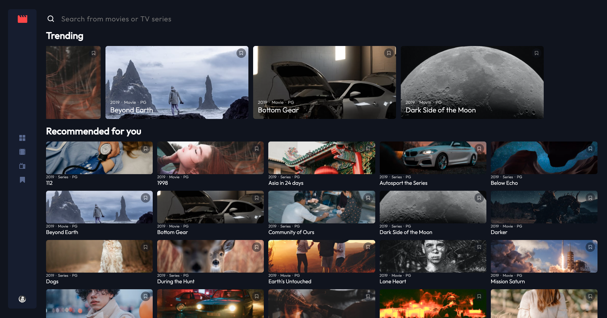
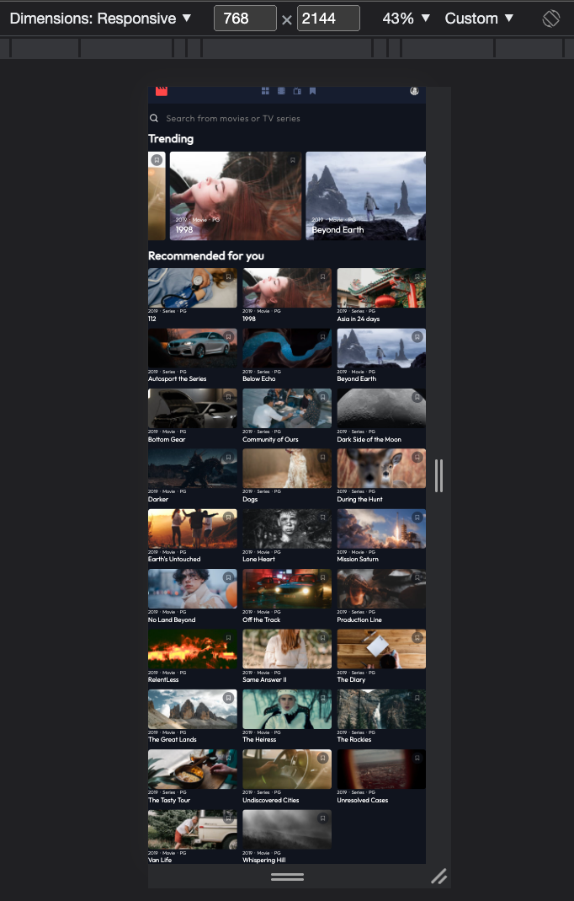
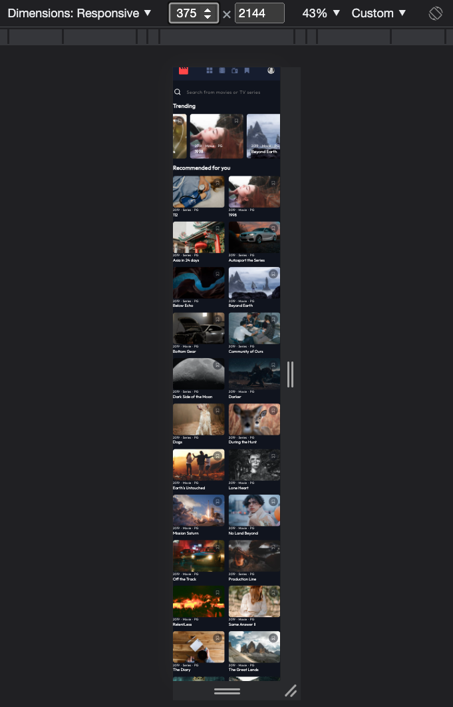

# Frontend Mentor - Entertainment web app solution

This is a solution to the [Entertainment web app challenge on Frontend Mentor](https://www.frontendmentor.io/challenges/entertainment-web-app-J-UhgAW1X). Frontend Mentor challenges help you improve your coding skills by building realistic project.

## Table of contents

- [Overview](#overview)
  - [The challenge](#the-challenge)
  - [Screenshot](#screenshot)
  - [Links](#links)
- [My process](#my-process)
  - [Built with](#built-with)
  - [What I learned](#what-i-learned)
  - [Continued development](#continued-development)
  - [Useful resources](#useful-resources)
- [Author](#author)
- [Acknowledgments](#acknowledgments)

**Note: Delete this note and update the table of contents based on what sections you keep.**

## Overview

### The challenge

Users should be able to:

- [x] View the optimal layout for the app depending on their device's screen size
- [ ] See hover states for all interactive elements on the page
- [x] Navigate between Home, Movies, TV Series, and Bookmarked Shows pages
- [x] Add/Remove bookmarks from all movies and TV series
- [x] Search for relevant shows on all pages
- [ ] **Bonus**: Build this project as a full-stack application
- [ ] **Bonus**: If you're building a full-stack app, we provide authentication screen (sign-up/login) designs if you'd like to create an auth flow

### Screenshot

### Links

- Live Site URL: [Watchify](https://mhsiungw.github.io/entertainment/)

## My process

### Built with

- React
- React Router v6
- Emotion
- Swiper

### What I learned

1. Emotion
   a. use ThemeProvider to set up CSS variables and use useTheme hook to get access to these variables
   b. use Global to set up global style
   c. customise media query hook
2. React Router v6
   a. use BrowserRouter, Routes and Route to make SPA with navigation
   b. build nested routes with Route and Outlet
   c. use useNavigate to navigate programmatically
3. Swiper
   a. implement slider effect using Swiper and SwiperSlide

### Continued development

1. make local state global using Redux or Context
2. make this project full stack

### Useful resources

- [Emotion](https://emotion.sh/docs/introduction)
  This helped me to write CSS in JS. It really makes styling in React easier.
- [Understanding ReactJs Project Structure and Folder Setups](https://www.xenonstack.com/insights/reactjs-project-structure)
  This is an amazing article about the structure of a React project. It helps me to organise my React project in more controllable way.

## Author

- Github - [min](https://github.com/mhsiungw)
- Frontend Mentor - [@mhsiungw](https://www.frontendmentor.io/profile/mhsiungw)
- Twitter - [@Minhsiungwang](https://twitter.com/Minhsiungwang)
